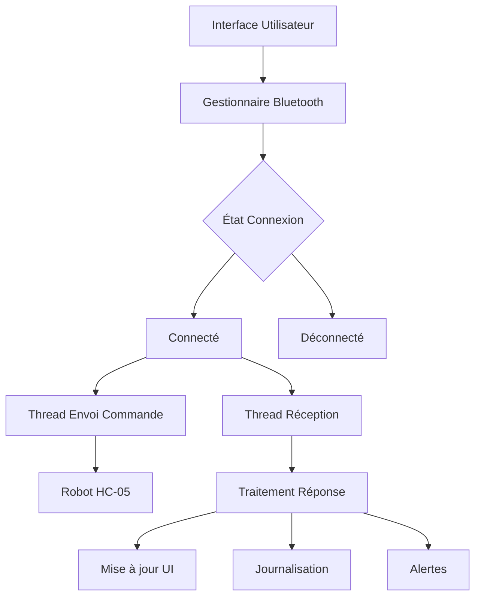

# SerbAI_mobile_application
SerbAI is the Android-based command and supervision interface for an autonomous line-following robot designed to serve orders in a café or restaurant environment. This project, aims to modernize in-house service by using a custom-built robot to deliver items to customer tables, reducing the need for human servers for this specific task.

# **SerbAI-Control** - Application de Contrôle et Supervision Robotique

## 📋 Contexte du Projet

Le projet s'inscrit dans le domaine de la **robotique de service**, où des robots autonomes sont utilisés pour assister ou remplacer des tâches humaines. Le pilotage et la supervision de ces robots nécessitent une **interface homme-machine (IHM)** fiable, complète et facile d'utilisation.


## 🎯 Besoin Identifié

Il existe un besoin pour une **application mobile centralisée** capable de :
- Contrôler et superviser un robot de service via communication sans fil
- Permettre à un opérateur de gérer l'état du robot (connexion, modes opératoires)
- Pilotage manuel avec précision
- Réception d'alertes en temps réel
- Configuration des paramètres pour différents contextes d'utilisation
- Interface **sécurisée et réactive**

## 🚀 Solution Proposée : SerbAI-Control

L'application **SerbAI-Control** apporte une solution robuste en agissant comme un **tableau de bord de contrôle complet** :

### **Architecture Technique**
- **Communication bidirectionnelle asynchrone** avec le robot via Bluetooth SPP
- **Délégation des opérations réseau** à des threads d'arrière-plan (pas de blocage de l'interface)
- **Architecture événementielle** :
  - Envoi de commandes textuelles courtes au robot
  - Interprétation des messages de retour pour mise à jour dynamique de l'interface
- **Écran de paramètres** pour flexibilité et adaptabilité

---

## 📊 Résumé des Fonctionnalités

### **1. Gestion de la Connexion et Configuration** ⚙️

| Fonctionnalité | Description | Bénéfice |
|----------------|-------------|-----------|
| **Connexion Bluetooth Sécurisée** | Connexion à un robot via adresse MAC configurable | Sécurité et identification précise |
| **Connexion Automatique** | Tentative automatique au démarrage | Rapidité d'utilisation |
| **Validation des Prérequis** | Vérification permissions Bluetooth | Expérience utilisateur fluide |
| **Feedback de Connexion Explicite** | État en temps réel (Connecté/Déconnecté/Erreur) | Transparence sur l'état système |
| **Panneau de Paramètres** | Configuration adaptable :<br>• Adresse MAC<br>• Connexion auto<br>• Retour haptique<br>• Vitesse par défaut | Personnalisation selon besoins |

### **2. Contrôle et Pilotage du Robot** 🎮

#### **Modes Opérationnels**
| Mode | Commande | Description | Interface |
|------|----------|-------------|-----------|
| **Mode Automatique** | `A` | Robot autonome (ex: suivi de ligne) | Panneau manuel caché |
| **Mode Manuel** | `M` | Contrôle total par opérateur | Affichage panneau de contrôle |
| **Mode Arrêt** | `S` | Pause, moteurs désactivés | Interface simplifiée |

#### **Commandes de Contrôle**
| Catégorie | Commandes | Description | Feedback |
|-----------|-----------|-------------|----------|
| **Direction** | `F`, `B`, `L`, `R` | Avancer, Reculer, Gauche, Droite | Vibration + log |
| **Pivot** | `G`, `D` | Pivot sur place gauche/droite | Vibration + log |
| **Vitesse** | `1`, `2`, `3` | Lent, Moyen, Rapide | Changement couleur boutons |
| **Urgence** | `X` | Arrêt immédiat complet | Vibration + alerte visuelle |

### **3. Supervision et Monitoring** 📊

| Fonctionnalité | Composant | Utilité |
|----------------|-----------|---------|
| **Journal d'Événements** | Logs horodatés | Traçabilité complète des opérations |
| **Système d'Alertes** | Alertes visuelles + vibration | Détection conditions anormales |
| **Diagnostic** | Commandes `T` et `?` | Test liaison + rapport statut |
| **Retour Haptique** | Vibration sur actions critiques | Confirmation physique des commandes |

---

## 🏗️ Architecture de Communication



### **Protocole de Communication**
```
Format Commande : [Lettre/Nombre] (ex: T, A, F, 2)
Format Réponse : [CATEGORIE]:[VALEUR] (ex: TEST:OK, MODE:AUTO)
```

---

## 🎨 Expérience Utilisateur

### **Workflow Typique**
1. **Configuration** : Saisir l'adresse MAC du robot
2. **Connexion** : Appuyer sur "Connecter" ou connexion automatique
3. **Sélection Mode** : Choisir entre Auto/Manuel/Arrêt
4. **Contrôle** (si Manuel) :
   - Ajuster la vitesse
   - Utiliser les commandes directionnelles
5. **Monitoring** : Surveiller les logs et alertes
6. **Urgence** : Bouton dédié accessible à tout moment

### **Design Principles**
- **Simplicité** : Interface intuitive, pas de menus complexes
- **Réactivité** : Feedback immédiat sur chaque action
- **Robustesse** : Gestion des erreurs et reconnexion automatique
- **Flexibilité** : Paramétrable pour différents scénarios

---

## 🔧 Technologies Impliquées

| Composant | Technologie | Rôle |
|-----------|-------------|------|
| **Frontend** | Android (Java/Kotlin) | Interface utilisateur |
| **Communication** | Bluetooth SPP | Liaison sans fil robot |
| **Threading** | AsyncTask/Handlers | Gestion concurrentielle |
| **Stockage** | SharedPreferences | Sauvegarde paramètres |
| **Feedback** | Vibrator API | Retour haptique |

---

## 🛡️ Aspects Sécurité

1. **Authentification** : Basée sur adresse MAC (couche Bluetooth)
2. **Validation** : Vérification des permissions système
3. **Isolation** : Threads séparés pour éviter les interférences
4. **Logs** : Traçabilité complète des actions

---

## 🔮 Évolutions Futures Potentielles

1. **Multi-robot** : Gestion de plusieurs robots simultanés
2. **Cartographie** : Affichage position robot sur carte
3. **Scripting** : Programmation de séquences automatisées
4. **Cloud** : Synchronisation des logs et paramètres
5. **Voix** : Commandes vocales intégrées

---

## ✅ Avantages Clés

| Avantage | Impact |
|----------|---------|
| **Centralisation** | Toutes les fonctions dans une seule app |
| **Adaptabilité** | Paramétrable pour différents robots |
| **Fiabilité** | Architecture robuste et redondante |
| **Accessibilité** | Interface intuitive même pour non-experts |
| **Maintenabilité** | Code structuré et documenté |

---

# Plan de Test Fonctionnel 

## Vue d'ensemble
Cette partie décrit le plan de test complet pour l'application SerbAI-Control, une application mobile permettant de contrôler un robot via Bluetooth. Le plan est divisé en 5 phases de test successives.

---

## Phase 1 : Test de la Connexion et Déconnexion

### 1. Bouton "Connecter" (btnConnect)
**Action** : Appuyer sur "Connecter"

**Résultats attendus** :
- ✅ Le log affiche "🔄 Tentative de connexion..."
- ✅ Si l'adresse MAC est invalide ou non configurée :
  - Message d'erreur "Adresse MAC non configurée"
  - Ouverture automatique de l'écran des paramètres
- ✅ Si la connexion réussit :
  - Statut passe à "🟢 Connecté"
  - Log affiche "✅ Connecté au robot HC-05"
  - Tous les boutons de contrôle deviennent actifs
  - Bouton "Connecter" se désactive
  - Bouton "Déconnecter" s'active
  - Envoi automatique des commandes :
    - Commande de test (T)
    - Commande de vitesse (1, 2 ou 3)

### 2. Bouton "Déconnecter" (btnDisconnect)
**Action** : Appuyer sur "Déconnecter" (après connexion réussie)

**Résultats attendus** :
- ✅ Statut passe à "🔴 Déconnecté"
- ✅ Log affiche "🔌 Déconnecté"
- ✅ Tous les boutons de contrôle se désactivent
- ✅ Bouton "Connecter" redevient actif
- ✅ Bouton "Déconnecter" se désactive
- ✅ Panneau de contrôle manuel disparaît

---

## Phase 2 : Test des Commandes Générales
*Prérequis : Être connecté*

### 3. Bouton "Test" (btnTest)
**Action** : Appuyer sur "Test"

**Résultats attendus** :
- ✅ Commande T envoyée au robot
- ✅ Réponse du robot contenant "TEST:OK"
- ✅ Message "✅ Robot opérationnel!" affiché

### 4. Bouton "Statut" (btnStatus)
**Action** : Appuyer sur "Statut"

**Résultats attendus** :
- ✅ Commande ? envoyée au robot
- ✅ Réception des informations du robot :
  - Mode
  - Vitesse
  - Obstacle
  - IR, etc.
- ✅ Affichage des informations dans le log

---

## Phase 3 : Test des Modes Opérationnels

### 5. Bouton "Mode Auto" (btnAuto)
**Action** : Appuyer sur "AUTO"

**Résultats attendus** :
- ✅ Commande A envoyée
- ✅ Log affiche "🚀 Mode Auto activé"
- ✅ Panneau de contrôle manuel disparaît (s'il était visible)
- ✅ Statut mis à jour : "Mode: AUTO"

### 6. Bouton "Stop" (btnStop)
**Action** : Appuyer sur "STOP"

**Résultats attendus** :
- ✅ Commande S envoyée
- ✅ Log affiche "⏸️ Robot arrêté (mode Stop)"
- ✅ Panneau de contrôle manuel disparaît
- ✅ Statut mis à jour : "Mode: STOP"

### 7. Bouton "Arrêt d'Urgence" (btnStopUrgence)
**Action** : Appuyer sur "Arrêt d'Urgence"

**Résultats attendus** :
- ✅ Commande X envoyée
- ✅ Log affiche "🛑 ARRÊT URGENCE activé"
- ✅ Message "ARRÊT D'URGENCE!" affiché à l'écran
- ✅ Vibration du téléphone (si activée dans paramètres)

### 8. Bouton "Mode Manuel" (btnModeManuel)
**Action** : Appuyer sur "Mode Manuel"

**Résultats attendus** :
- ✅ Commande M envoyée
- ✅ Log affiche "🎮 Mode Manuel activé"
- ✅ Panneau de contrôle manuel apparaît
- ✅ Boutons du panneau manuel deviennent actifs
- ✅ Statut mis à jour : "Mode: MANUEL"

---

## Phase 4 : Test des Commandes Manuelles
*Prérequis : Connecté et en "Mode Manuel"*

### 9. Boutons de Direction
**Actions** : Appuyer sur chaque bouton directionnel

**Boutons testés** :
- **btnForward** (Avancer)
  - ✅ Commande F envoyée
  - ✅ Log affiche "⬆️ Avancer"
  - ✅ Vibration brève (si activée)

- **btnBackward** (Reculer)
  - ✅ Commande B envoyée
  - ✅ Log affiche "⬇️ Reculer"
  - ✅ Vibration brève (si activée)

- **btnLeft** (Gauche)
  - ✅ Commande L envoyée
  - ✅ Log affiche "⬅️ Tourner gauche"
  - ✅ Vibration brève (si activée)

- **btnRight** (Droite)
  - ✅ Commande R envoyée
  - ✅ Log affiche "➡️ Tourner droite"
  - ✅ Vibration brève (si activée)

### 10. Boutons de Pivot
**Actions** : Appuyer sur chaque bouton de pivot

**Boutons testés** :
- **btnPivotLeft** (Pivot gauche)
  - ✅ Commande G envoyée
  - ✅ Log affiche "↪️ Pivot gauche"
  - ✅ Vibration brève (si activée)

- **btnPivotRight** (Pivot droite)
  - ✅ Commande D envoyée
  - ✅ Log affiche "↩️ Pivot droite"
  - ✅ Vibration brève (si activée)

### 11. Bouton "Stop Moteur" (btnStopMoteur)
**Action** : Appuyer sur le bouton "Stop" du panneau manuel

**Résultats attendus** :
- ✅ Commande 0 envoyée
- ✅ Log affiche "⏸️ Stop moteur"
- ✅ Vibration brève (si activée)

---

## Phase 5 : Test du Contrôle de Vitesse
*Prérequis : En "Mode Manuel"*

### 12. Boutons de Vitesse
**Actions** : Appuyer sur chaque bouton de vitesse

**Boutons testés** :

#### "Lent" (btnSpeedSlow)
- ✅ Commande 1 envoyée
- ✅ Log affiche "🐢 Vitesse LENTE"
- ✅ Bouton "Lent" :
  - Change de couleur (devient vert actif)
  - Les autres boutons deviennent gris inactifs

#### "Moyen" (btnSpeedMed)
- ✅ Commande 2 envoyée
- ✅ Log affiche "🚶 Vitesse MOYENNE"
- ✅ Bouton "Moyen" :
  - Change de couleur (devient orange actif)
  - Les autres boutons deviennent gris inactifs

#### "Rapide" (btnSpeedFast)
- ✅ Commande 3 envoyée
- ✅ Log affiche "🏃 Vitesse RAPIDE"
- ✅ Bouton "Rapide" :
  - Change de couleur (devient rouge actif)
  - Les autres boutons deviennent gris inactifs

---

## Notes importantes pour les tests

### Conditions préalables
1. Robot allumé et opérationnel
2. Bluetooth activé sur le téléphone
3. Adresse MAC du robot configurée dans l'application
4. Batterie du robot suffisamment chargée

### Séquence recommandée
1. Exécuter les phases dans l'ordre
2. Toujours tester la déconnexion après chaque connexion
3. Tester tous les modes avant les commandes manuelles
4. Vérifier les feedbacks visuels et haptiques

### Critères de réussite
- Toutes les commandes sont envoyées avec succès
- Tous les feedbacks utilisateur sont fonctionnels
- Aucun crash de l'application
- Gestion correcte des erreurs de connexion
- Interface utilisateur réactive et intuitive

---

## Journalisation des tests
Date du test : 15/12/2026
Testeur : AHOUZI Hasnae
Version de l'application : V0.4
Résultat global :  Réussi

| Phase | Test | Résultat | Observations |
|-------|------|----------|--------------|
| 1 | Connexion | done | rapide |
| 1 | Déconnexion | done | rapide |
| 2 | Test robot | done | |
| 2 | Statut robot | done | |
| 3 | Mode Auto | done | |
| 3 | Mode Stop | done | |
| 3 | Urgence | done | utile |
| 3 | Mode Manuel | done | stable|
| 4 | Directions | done | |
| 4 | Pivots | done | |
| 4 | Stop moteur | done | imidiat |
| 5 | Vitesses | done | moyenne est la plus stable|

---

**SerbAI-Control** représente une solution complète pour le contrôle robotique, combinant simplicité d'utilisation avec des fonctionnalités avancées de supervision, le tout dans une interface mobile moderne et réactive.
